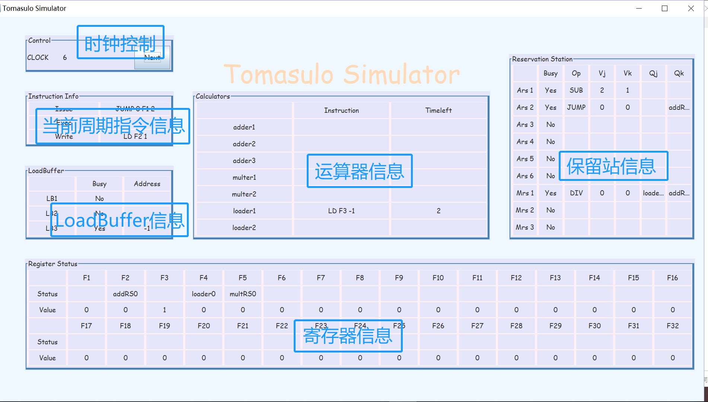
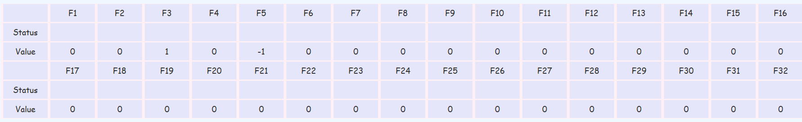
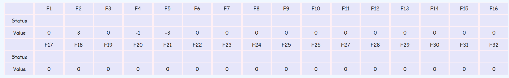
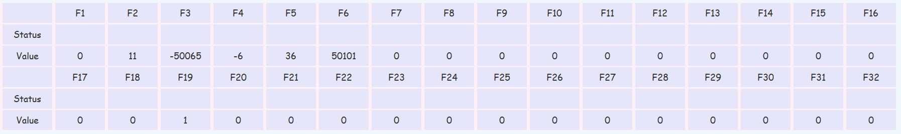
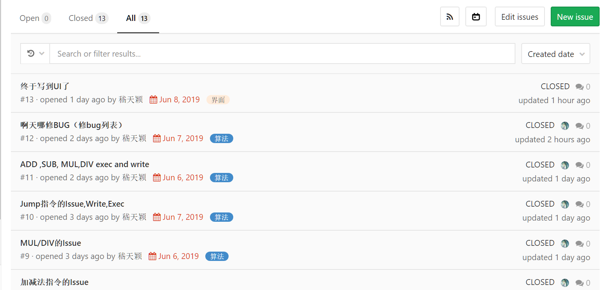
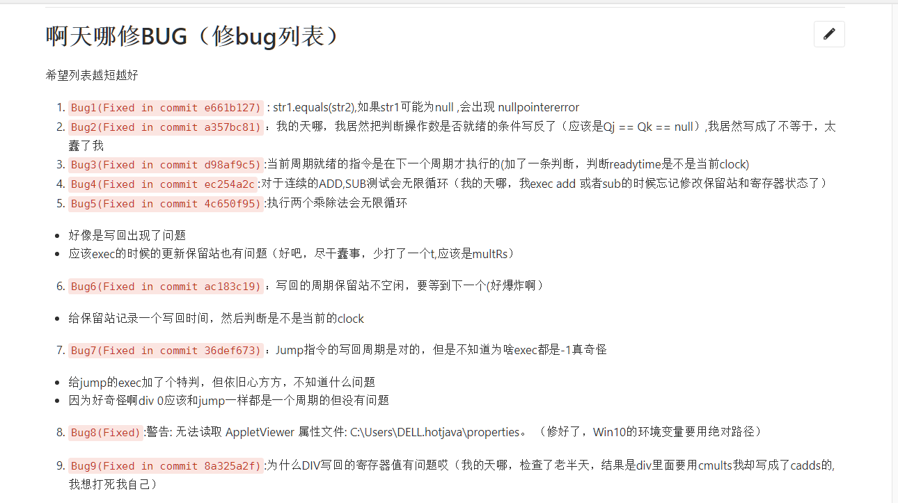
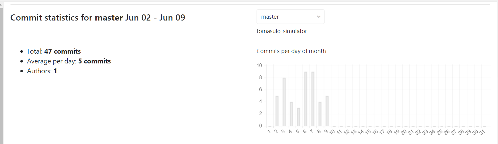
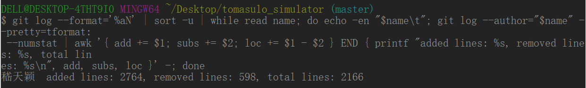

> 计64	嵇天颖	2016010308

### Tomasulo Simulator 实验报告

**目录**

[TOC]


---


#### 1	实验要求

​		本实验要求同学们使用 `C/C++，python，Java `等常见编程语言设计一个用户态的 `Tomasulo` 动态流水线调度算法模拟器，能够接受一种被称为 `NEL`（相关定义参见附录）的 最简单汇编语言作为输入，模拟它在特定硬件平台（相关定义参见附录）的执行情况（各类指 令的假设运行时间在附录中给出），给出任意时钟周期的指令状态，保留栈状态，寄存器结果 状态和寄存器数值等目标结果。 

---


#### 2	实验原理

`Tomasulo `算法以硬件⽅式实现了寄存器重命名，允许指令乱序执⾏，这是提⾼流⽔线的吞吐 率和效率的⼀种有效⽅式。该算法⾸先出现在` IBM360/91 `处理机的浮点处理部件中，后⼴泛 应⽤于现代处理器设计中。

其核心思想是：记录和检测指令相关，操作数一旦就绪就立即执行，把发生`RAW`（写后读）冲突的可能性减少到最少。通过寄存器换名来消除`WAR`（读后写）和`WAW`（写后写）冲突。

`Tomasulo`算法分为三段：`Issue` ,`Execution`, `Write Result`。如果保留站空闲(无结构冒险),控制机制发射指令并发送操作数(对寄存器进行换名)；如果两个操作数都已就绪,且有空闲的运算器，指令就准备就绪，可以执行;如果没有就绪,就观测公共数据总线等待所需结果。写回周期通过公共数据总线将结果写入到所有等待的部件;

---


#### 3	完成功能

##### 		3.1	功能列表

|      | 基础功能                                                     |
| ---- | ------------------------------------------------------------ |
| 1    | 能够正确接受任意`NEL`汇编语言编写的指令序列作为输入          |
| 2    | 能够正确输出每一条指令发射的时间周期**，**执行完成的时间周期**，**写回结果的时间周期 |
| 3    | 能够正确输出各时间周期的寄存器数值                           |
| 4    | 能够正确输出各时间周期保留站状态、`LoadBuffer`状态和寄存器结果状态 |
|      | **附加功能**                                                 |
| 1    | 设计美观的交互界面                                           |


##### 		3.2	功能展示

​	 下面的展示基于测试样例`test0.nel`，并采用测试用运行时间

~~~java
//测试运行时间
final int LDTime = 3, ADDTime = 3, MULTime = 4, 
					  DIVTime = 4, JUMPTime = 1;
~~~

​     

**基础功能**

   1. 能够正确接受任意`NEL`汇编语言编写的指令序列作为输入

      * 读入`test0.nel`

      * 获得命令行输出

        ~~~c
        -----------Instructions-----------
        0 LD,F1,0x2
        1 LD,F2,0x1
        2 LD,F3,0xFFFFFFFF
        3 SUB,F1,F1,F2
        4 DIV,F4,F3,F1
        5 JUMP,0x0,F1,0x2
        6 JUMP,0xFFFFFFFF,F3,0xFFFFFFFD
        7 MUL,F3,F1,F4
        ~~~

      * 该功能实现成功

   2. 能够正确输出每一条指令发射的时间周期**，**执行完成的时间周期**，**写回结果的时间周期

       * 执行25个周期后，执行结束，命令行输出如下结果

         ~~~java
         -----------------------------------------------
         0 LD 1 4 5
         1 LD 2 5 6
         2 LD 3 7 8
         3 SUB 4 9 10
         4 DIV 5 14 15
         5 JUMP 6 11 12
         6 JUMP 12 13 14
         7 MUL 20 24 25
         ~~~

      * 该功能实现成功

			  3. 能够正确输出各时间周期的寄存器数值

         * 在`Clock = 1`处输出

           ~~~java
           F0 0 F1 0 F2 0 F3 0 F4 0 F5 0 F6 0 F7 0 
           F8 0 F9 0 F10 0 F11 0 F12 0 F13 0 F14 0 F15 0 
           F16 0 F17 0 F18 0 F19 0 F20 0 F21 0 F22 0 F23 0 
           F24 0 F25 0 F26 0 F27 0 F28 0 F29 0 F30 0 F31 0 
           ~~~

        * 在`Clock = 8`处输出

          ~~~c
          F0 0 F1 0 F2 1 F3 -1 F4 0 F5 0 F6 0 F7 0 
          F8 0 F9 0 F10 0 F11 0 F12 0 F13 0 F14 0 F15 0 
          F16 0 F17 0 F18 0 F19 0 F20 0 F21 0 F22 0 F23 0 
          F24 0 F25 0 F26 0 F27 0 F28 0 F29 0 F30 0 F31 0 
          ~~~

        * 该功能实现成功

			  4. 能够正确输出各时间周期保留站状态、`LoadBuffer`状态和寄存器结果状态

        * 保留站状态

          在`Clock = 6`时获得如下命令行输出

          ~~~java
          addRs 0 SUB Qj = null Qk = null Vj =2 Vk = 1
          addRs 1 JUMP Qj = null Qk = addRS0 Vj =0 Vk = 0
          addRs 2 null Qj = null Qk = null Vj =0 Vk = 0
          addRs 3 null Qj = null Qk = null Vj =0 Vk = 0
          addRs 4 null Qj = null Qk = null Vj =0 Vk = 0
          addRs 5 null Qj = null Qk = null Vj =0 Vk = 0
          multRs 0 DIV Qj = loader0 Qk = addRS0 Vj =0 Vk = 0
          multRs 1 null Qj = null Qk = null Vj =0 Vk = 0
          multRs 2 null Qj = null Qk = null Vj =0 Vk = 0
          ~~~

        * `LoadBuffer`状态

          在`Clock = 5`时获得如下命令行输出（为了减少输出，我这里只输出`Busy`状态的`LoadBuffer`)

          ~~~java
          LoadBuffer 1 LD isBusy = true loadAddr = 1
          LoadBuffer 2 LD isBusy = true loadAddr = -1
          ~~~

        * 寄存器结果状态

          在`Clock = 5`时获得如下命令行输出（为了减少输出，只输出等待结果的寄存器）

          ~~~java
          Registers
          F1 addRS0 F2 loader1 F3 loader0 F4 multRS0 
          ~~~

        * 该功能实现完成


 **附加功能**

1  设计美观的交互界面

​	交互界面如下图所示，点击`Next`按钮可以逐步运行，可以显示出：

		* `LoadBuffer`状态
		* 保留站状态
		* 运算器状态
		* 寄存器状态和数值
		* 当前时钟指令信息（在当前周期发射的指令，第一次执行完毕的指令，第一次写回的指令）


---


#### 4	实现设计思路

##### 		4.1	后端设计

###### 					4.1.1	CFG文法处理介绍

**1）	指令类型枚举类 `OperationType`**：支持六种类型指令（`LD,ADD,SUB,MUL,DIV,JUMP`)

~~~c
public enum OperationType {
	LD,
	ADD, SUB, MUL, DIV,
	JUMP
}
~~~


**2）	`CFG`语法定义类`Instruction`**

所支持的CFG文法：

~~~java
Program := InstList
InstList := Inst
InstList := Inst ‘\n’InstList
Inst := OPR‘,’REGISTER‘,’REGISTER ‘,’ REGISTER
Inst := “LD”‘,’REGISTER‘,’INTEGER
Inst := “JUMP” ‘,’ INTEGER‘,’ REGISTER ‘,’INTEGER
OPR := “ADD”|“MUL”| “SUB”| “DIV”
~~~

  根据 所提供的`CFG`文法定义，发现主要分为三类文法，故还据此实现了`Instruction`的三个派生类。

* `Instruction`类：

  由于存在`Jump`指令，有些指令会执行多次，而按照要求我们需要输出的第一次发射，执行和写回的周期，因此在此类中我们为每条指令记录了`issue`,`exec`,`write`的数值，以期和后面的诸次时间区别

  **成员变量**：

  ~~~java
  public OperationType OprType;		//指令类型（LD,ADD,SUB,MUL,DIV,JUMP）
  public int issue,exec,write;		//第一次issue,exec,write的时间
  ~~~

  **派生类：**

  为了方便观察寄存器的数值，在派生类的构造函数中，将十六进制立即数均转换为十进制

  * `LoadInstruction`类：处理`Inst := “LD”‘,’REGISTER‘,’INTEGER`

    * 成员变量

    ~~~java
    public int registerNo;	//寄存器编号
    public int loadAddr;	//存储的立即数（十六进制转成十进制）
    ~~~

  * `CalInstruction`类：处理`Inst := OPR‘,’REGISTER‘,’REGISTER ‘,’ REGISTER`

    * 成员变量

    ~~~java
    public int registerD;	//目的寄存器编号
    public int registerS1;	//第一位操作数寄存器编号
    public int registerS2;	//第二位操作数寄存器编号
    ~~~

    

  * `JumpInstruction`类：处理`Inst := “JUMP” ‘,’ INTEGER‘,’ REGISTER ‘,’INTEGER`

    * 成员变量

    ~~~java
    int compare;		//跳转条件
    int registerNo;		//寄存器编号
    int jumpAddr;		//跳转地址
    ~~~

    

###### 					4.1.2	模拟器算法部件处理介绍

**1）	模拟器类`Simulator`**

**成员变量**

* 固定参数设置（为寄存器数量，运算器数量，保留站数量，运行时间设置固定值，方便改动）

  ~~~java
  //参数设置
  final int CAddNum = 3, CMultNum = 2, CLoadNum = 2;
  final int AddRsNum = 6, MultRsNum = 3, LoadRsNum = 3;
  final int RegisterNum = 32;
  //真实运行时间
  final int LDTime = 3, ADDTime = 3, MULTime = 12, DIVTime = 40, JUMPTime = 1;
  //测试运行时间
  //final int LDTime = 3, ADDTime = 3, MULTime = 4, DIVTime = 4, JUMPTime = 1;
  ~~~

* 算法部件（包括运算器部件，保留站，和寄存器状态表）

  ~~~java
  //运算器部件
  Calculator[] cadds;
  Calculator[] cmults;
  Calculator[] cloads;
  //保留站
  ReserveStation[] addRs;
  ReserveStation[] multRs;
  LoadBuffer[] loadBuffers;
  //寄存器状态表
  RegisterStatus[] registers;
  ~~~

* 与`UI`的联动

  ~~~java
  //连接UI
  Tomasulo superUI;
  ~~~

* 指令集序列与信号量（提供对模拟器的运行的一些必要输入量和状态判断和转变的信号量）

  ~~~java
  Instruction[] inst;		//指令集序列
  boolean needJump;		//Jump指令		
  int nextInstIndex;		//下一条待发射指令的序号
  boolean finishAllInst;  //是否全部结束
  int clock;				//时钟
  ~~~

**主要成员函数**

* 指令发射（为不同指令分别设计了不同的子函数）

~~~java
- issue()		//指令发射
	- IssueAdd()		//ADD,SUB
    - IssueJUMP()	//JUMP
    - IssueLoad()	//LD
    - IssueMUL()		//JUMP
~~~

* 指令运行（在各指令的子函数中调用更新函数和获得结果函数）

~~~java
- exec()		//指令运行
    - execAdd()		//ADD,SUB,JUMP
    - execLoad()		//LD
    - execMult()		//MUL,DIV
    	- ExecUpdateRegisters() 	//寄存器更新
    	- ExecUpdateRs()			//保留站更新
    	- getCalResult()			//获得运行结果
~~~

* 指令写回（在各指令的子函数调用更新函数）

~~~java
- write()		//指令写回
    - writeAdd()	//ADD,SUB,JUMP
    - writeLoad()	//Ld
    - writeMult()	//MUL,DIV
    	- upDateRegisters 	//更新寄存器状态
    	- upDateReservation //更新保留站
~~~


**2）	运算器部件类`Calculator`**

实验要求的运算器为：3个加减法运算器，2个乘除法运算器，2个load运算器。我在这里将他们抽象化为统一的运算器类`Calculator`：

* 成员变量

  ~~~java
  Instruction instruction; //指令信息
  int remainRunTime;		 //剩余运行时间
  boolean isBusy;			 //当前运算器是否被占用
  int result;				 //指令运行结果
  LoadBuffer cloadBuffer;	 //若为Load指令所占用的LoadBuffer	
  ReserveStation calRs;	 //若为ADD,SUB,MUL,DIV指令所占用的Rs
  ~~~


**3）	保留站部件类`Reserve Station`**

实验要求了6个加减法保留站和3个乘除法保留站以及3个`LoadBuffer`,由于`LoadBuffer`并无`Vj,Vk,Qj,Qk`等状态字段，因此我进行了分离,此处的`Reserve Station`只支持加减法保留站和乘除法保留站。

我们这里需要指令的发射时间，就绪时间和写回时间是因为：指令的运行可能不止一次，我们在`Instruction`类的设计中，是记录了第一次发射，执行和写回的时间。而这里并非如此，保留站部件类中记录的是指令的本次运行时发射，执行和写回的时间。

 * 成员变量

   ~~~java
   Instruction instruction;	//指令信息
   	
   boolean isBusy;				//当前保留站是否被占用
   boolean isExec;				//当前保留站的指令是否被运行
   OperationType operation;	//当前操作指令类型
   String Qj, Qk;				//保留站字段
   int Vj, Vk;					//保留站字段
   
   boolean isReady;	//当前操作数是否均就绪
   boolean S1Ready;	//第一操作数就绪
   boolean S2Ready;	//第二操作数就绪
   
   int issueTime;		//指令流出时间
   int readyTime;		//操作数就绪时间
   int writeTime;		//指令写回时间
   ~~~


**4）	Load保留站部件类`LoadBuffer`**

仿造`Reserve Station`类，我创建了`LoadBuffer`类，但可以去除关于第一操作数和第二操作数的相关字段。

* 成员变量

  ~~~java
  Instruction instruction;	//指令信息
  	
  boolean isBusy;				//当前保留站是否被占用
  boolean isExec;				//当前保留站的指令是否被运行
  int issueTime;				//指令发射时间
  int writeTime;				//指令写回时间
  ~~~


**5）	寄存器状态表部件类`RegisterStatus`**

实验要求我们支持32个寄存器，我们需要处理寄存器的状态和数值字段。我们需要设置`isWaiting`字段，来辅助寄存器改名操作。

* 成员变量

  ~~~java
  String stateFunc;	//寄存器状态	
  int value;			//寄存器数值
  
  boolean isWaiting;	//是否在等待执行写回
  ~~~

  

###### 					4.1.3	算法流程设计

**1）	`Runsimulator`算法执行总控制函数**

在`Runsimulator`中主要调用了`issue()`,`exec()`和`write()`函数，关于这三个函数的一些子函数也在前面的部分说明了。此外还有调用了判停的准则，以及与UI的刷新连接。

~~~java
	public void runSimulator(Instruction[] inst) {
		this.inst = inst;
        //判停
		if(nextInstIndex >= inst.length && isFinished()) {
			finishAllInst = true; 
			printResult();
			return;
		}
		finishAllInst = false;
		//计时器
		clock ++;
		System.out.println("-----------"+"Clock: "+clock+"-----------");
        //执行过程
		write();
		exec();
		issue();
        //输出
		printRs();
		System.out.println("Registers");
		printReg();
		//UI刷新
		superUI.updateUI(finishAllInst);
		return;
	}
~~~


**2）	`issue`过程分析**

* 执行流程：

  * 遍历保留站，寻找处于空闲的对应保留站

  * 如果存在相应的空闲保留站，则发射指令

  * 指令发射后需要更新指令的issue信息（我们需要记录的是指令第一次发射的时间）

    ~~~java
    //更新指令信息(第一次发射的时间)
    if(instruction.issue == -1) { //指令从未发射过
    	instruction.issue = clock;
    }
    ~~~

  * 更新保留站信息

    * 发射`LD`指令需要更新`LoadBuffer`的执行指令，忙闲状态还有发射时间
    * 发射`ADD/SUB/JUMP/MUL/DIV`指令相应地要更新对应的`addRs`或者`multRs`的信息，以及需要判断操作数是否就绪

  * 更新寄存器状态信息

    * 设置寄存器的`stateFunc`字段为指令所占用的保留站
    * 同时设置寄存器为`isWaiting`状态

* 特殊处理：

  由于`Jump`指令尚未写回时不能发射它后面的指令，所以我们需要给`issue()`操作设置开关`needJump`。

  当`Jump`指令未写回时，我们不进行`Jump`之后的指令的发射工作。在`Jump`指令的写回函数里进行`needJump`的更新，打开继续发射的开关。

  ~~~java
  if(needJump || nextInstIndex > inst.length -1) return; //Jump 未写回，不能发射下一条
  ~~~

  

**3）	`exec`过程分析**

* 执行过程

  * 更新已被占用的运算器资源信息：

    我们遍历运算器资源，如果该运算器正在运行，我们需要更新它的剩余运行时间，如果它在当前周期运行完毕，我们需要记录它运行完成的时间`exectime`

  * 我们查看是否有空闲的运算器资源，如果还有剩余运算器资源：

    此时可能有多个指令就绪，理论上我们需要维护一个就绪队列。但实际上我只要找到最先就绪的指令就行了，后面的暂时是无需管的。

  * 当我们取到了最先就绪的指令，我们将会让该指令占用空闲的运算器资源：
    * 更新被占用的运算器的资源信息
    * 更新指令相关的保留站信息（我们要设置保留站的`isExec`字段为真）
    * 关联运算器与占用的保留站
    * 更新寄存器信息`ExecUpdateRegisters`
    * 更新保留站信息`ExecUpdateRs`

* 特殊处理

  * 运算器信息中包含了就绪指令的计算结果，由于各个指令的不同，所以编写了`getcalResult`函数来获得运算结果

  * 因为`LD`指令的运算结果可以直接从指令信息中得到，无需再运算，因此该函数对`LD`不进行处理

  * `DIV`指令如果除数为0的话，执行周期变成1，直接返回被除数

    ~~~java
    case DIV:
        if(multRs[rsindex].Vk == 0) {	//如果除数为0
            result = multRs[rsindex].Vj; //将被除数存入寄存器
            cmults[calindex].remainRunTime = 1; //运行周期为1
        }
        else {	//被除数不为0
            result = multRs[rsindex].Vj / multRs[rsindex].Vk;
        }
        break;
    ~~~

  * `JUMP`指令如果满足跳转要求，会向前跳`jumpAddr`条指令，如果不是就向后执行

    ~~~java
    case JUMP:
        cadds[calindex].remainRunTime = JUMPTime;
        if(addRs[rsindex].Vj == addRs[rsindex].Vk) {  //满足跳转条件
            result = ((JumpInstruction)addRs[rsindex].instruction).jumpAddr;
        }else {		//不满足跳转条件
            result = 1;
        }
        break;
    ~~~


**4）	`write`过程分析**

* 执行过程

  * 寻找当前周期运行结束的指令

  * 更新运算资源的信息：

    运算器空闲，剩余运算时间为0

  * 更新运算器所对应的保留站信息：

    将所使用的保留站的各项字段清空

  * 更新指令写回信息：（与`issue`操作类似）

    ~~~java
    //更新指令写回信息
    if(cadds[i].instruction.write == -1)	//第一次在本周期写回的指令
        cadds[i].instruction.write = clock;
    ~~~

  * 如果是`LD,ADD,SUB,MUL,DIV`指令的写回：

    * 更新寄存器状态表信息（写回运算结果到所占用的寄存器）
    * 更新保留站信息（更新保留站中用到该寄存器的`Vj,Vk,Qj,Qk`信息）

  * 如果是`JUMP`指令的写回

    * 打开`issue()`的开关`needJump`
    * 更新到下一条指令的`index`

* 特殊处理

  在询问助教后明确了写回的周期保留站并不空，要等到下一个周期才能被占用。

  而我在总控函数中是先`write()`后`issue()`的所以会出现问题，因此我利用`writetime`字段来处理这一问题。在`issue`的时候判断该保留站写回的时间是不是当前周期，这样的话可以解决这个问题。


##### 		4.2	前端设计

###### 					4.2.1	主要类介绍

前端用`JFrame`作为窗口，其中主要放置了6个`JPanel`部件。下面文件的类都是`JPanel`的派生类，具体由大量的`JLabel`和一个`JButton`构成。

```java
RegisterUI.java			//寄存器状态表
ReservationUI.java		//保留站
LoadBufferUI.java		//LoadBuffer
CalculatorUI.java		//运算器
InstInfoUI.java			//当前周期第一次发射，执行完毕和写回的指令
ClockUI.java			//时钟控制
```
具体的位置的样子见下图：




###### 					4.2.2	前端函数介绍

前端涉及的函数主要有四种：按钮绑定的监听函数，刷新UI界面函数，显示字符处理的函数和用于界面字体美化的函数。

* UI界面刷新函数：

  * 分为五个子函数，分别用于不同`Panel`的更新

  ~~~java
  public void updateUI(boolean finished) {
      updateLoadBuffer();
      updateRegisters();
      updateReservation();
      updateCalculators();
      updateInstInfo();
  }
  ~~~

  * 函数`getInstInfo()`和`getInst()`用于生成需要显示的指令相关的字符串

* 按钮绑定的监听函数：将按钮与算法中的`clock`关联起来

~~~java
tomasuloUI.controlPanel.button.addActionListener(new ActionListener() {
    @Override
    public void actionPerformed(ActionEvent e) {
        tomasuloUI.tomasuloSimulator.runSimulator(inst);
        tomasuloUI.controlPanel.clock.setText(Integer.toString(tomasuloUI.tomasuloSimulator.clock));
    }
});
~~~

* 界面字体全局美化函数`setUIFont()`:利用`UIManager`对全局字体进行美化操作

  ~~~java
  public static void setUIFont() //修改全局字体
  {
      Font f = new Font("Comic Sans MS",Font.PLAIN,18);
      String   names[]={ "Label", "CheckBox", "PopupMenu","MenuItem", "CheckBoxMenuItem","JRadioButtonMenuItem","ComboBox", "Button", "Tree", "ScrollPane", "TabbedPane", "EditorPane", "TitledBorder", "Menu", "TextArea",
   "OptionPane", "MenuBar", "ToolBar", "ToggleButton", "ToolTip","ProgressBar", "TableHeader", "Panel", "List", "ColorChooser", "PasswordField","TextField", "Table", "Label", "Viewport", "RadioButtonMenuItem","RadioButton", "DesktopPane", "InternalFrame" }; 
      for (String item : names) {
          UIManager.put(item+ ".font",f); 
      }
  }
  ~~~

  

---


#### 5	程序运行说明

- 本地使用的运行环境：

  ```c
  java version "1.8.0_191"
  Java(TM) SE Runtime Environment (build 1.8.0_191-b12)
  Java HotSpot(TM) 64-Bit Server VM (build 25.191-b12, mixed mode)
  ```

- 本地使用的编译器：

  ```c
  eclipse-jee-2019-03-R-win32-x86_64
  ```

---


#### 6	项目文件说明

~~~java
.
|- bin							
|- report				//实验报告
	|_figs
	|_2016010308嵇天颖_report.md
	|_2016010308嵇天颖_report.pdf
|- src					//源代码
	|_Tomasulo.java				//入口函数文件
	|_OperationType.java		
	|_Instruction.java
	|_Simulator.java			//1-3是后端算法文件
	|_RegisterUI.java
	|_ReservationUI.java
	|_LoadBufferUI.java
	|_CalculatorUI.java
	|_InstInfoUI.java
	|_ClockUI.java				//4-9是前端组件文件
|- test					//测试文件
	|_addsub.nel
	|_div0.nel
	|_muldiv.nel
	|_overNum.nel
	|_test0.nel
	|_test1.nel
	|_test2.nel
|- res					//测试结果
	|_addsubres.nel
	|_div0res.nel
	|_muldivres.nel
	|_overNumres.nel
	|_test2res.nel
|- README.md			//运行说明
|- .classpath
|- .project
	
~~~

---


#### 7 	运行实例

##### 		7.1	提供的三份测试

**`test0.nel`**

采用了测试运行时间:(中间步骤贴图的话太多了，所以只放最终结果。中间过程与所提供的例子一致。)

* 指令发射，运行和写回时间

~~~java
0 LD 1 4 5
1 LD 2 5 6
2 LD 3 7 8
3 SUB 4 9 10
4 DIV 5 14 15
5 JUMP 6 11 12
6 JUMP 12 13 14
7 MUL 20 24 25
~~~

* 最终的寄存器数值




**`test1.nel`**

采用了真实运行时间

* 指令发射，运行和写回时间

~~~java
0 LD 1 4 5
1 LD 2 5 6
2 LD 3 7 8
3 ADD 4 9 10
4 MUL 5 20 21
5 DIV 6 48 49
6 SUB 7 52 53
7 JUMP 8 9 10
~~~

* 最终的寄存器数值




**`test2.nel`**

采用了真实运行时间

* 指令发射，运行和写回时间

~~~java
0 LD 1 4 5
1 LD 2 5 6
2 LD 3 7 8
3 LD 6 9 10
4 ADD 7 13 14
5 DIV 8 54 55
6 MUL 9 21 22
7 LD 10 13 14
8 LD 11 14 15
9 SUB 12 25 26
10 SUB 13 18 19
11 JUMP 14 20 21
~~~


* 最终的寄存器数值




##### 		7.2	自己准备的NEL语言样例程序

下面都用了测试的运行时间

**`addsub.nel`**: 测试加减法指令的正常运行

~~~java
LD,F1,0x2
LD,F2,0x1
LD,F3,0xFFFFFFFF
SUB,F1,F1,F2
ADD,F3,F1,F2
~~~

输出结果：

~~~
0 LOAD 1 4 5
1 LOAD 2 5 6
2 LOAD 3 7 8
3 SUB 4 9 10
4 ADD 5 13 14
~~~


**`muldiv`**: 测试运算指令是否正常运行

~~~java
LD,F1,0x2
LD,F2,0x1
LD,F3,0xFFFFFFFF
SUB,F1,F1,F2
ADD,F3,F1,F2
DIV,F4,F3,F1
~~~

输出结果：

~~~java
0 LOAD 1 4 5
1 LOAD 2 5 6
2 LOAD 3 7 8
3 SUB 4 9 10
4 ADD 5 13 14
5 DIV 6 18 19
~~~


**`div0.nel`**：测试除0操作是否正常运行

~~~java
LD,F1,0x2
LD,F2,0x1
SUB,F1,F1,F2
ADD,F3,F1,F2
MUL,F4,F3,F1
LD,F3,0x0
DIV,F5,F4,F3
MUL,F6,F5,F4
~~~

输出结果:

~~~java
0 LOAD 1 4 5
1 LOAD 2 5 6
2 SUB 3 9 10
3 ADD 4 13 14
4 MUL 5 18 19
5 LOAD 6 9 10
6 DIV 7 20 21
7 MUL 8 25 26
~~~


**`overNum.nel`**: 测试如果就绪和运行的指令超过保留站数目

~~~java
LD,F1,0xC
LD,F2,0xFFFF3C6F
LD,F3,0xFFFFFFFA
LD,F4,0x0
ADD,F2,F2,F1
ADD,F3,F3,F2
ADD,F4,F3,F2
ADD,F4,F4,F3
ADD,F3,F2,F4
ADD,F3,F1,F4
ADD,F2,F1,F4
ADD,F3,F2,F1
~~~

输出结果

~~~java
0 LOAD 1 4 5
1 LOAD 2 5 6
2 LOAD 3 7 8
3 LOAD 6 9 10
4 ADD 7 10 11
5 ADD 8 14 15
6 ADD 9 18 19
7 ADD 10 22 23
8 ADD 11 26 27
9 ADD 12 26 27
10 ADD 13 26 27
11 ADD 16 30 31
~~~

---


#### 8	实验历程和感想

在经历了从放弃`Js`到转战`Java`，开了13个`issue`督促自己不要摸鱼：



经历了修了一个列表的愚蠢`Bug`（日常打死自己系列）:



边摸鱼边写了8天：



终于苟延残喘地极其冗长的2166行写完：



上课学`Tomasulo`算法的时候其实是一头雾水，不动手果然是了解浅薄。而写完这个模拟器，了解甚多，收获甚多。

---


#### 9	References

* nel 文件读写：https://blog.csdn.net/nickwong_/article/details/51502969
* setUIFont:  https://blog.csdn.net/u010889616/article/details/50907865
* 一些类的设计：<https://github.com/lizeyan/Tomasolu-emulator>
* 按钮绑定监听器：<https://www.cnblogs.com/pianistedward/p/10140712.html>

---------------------


